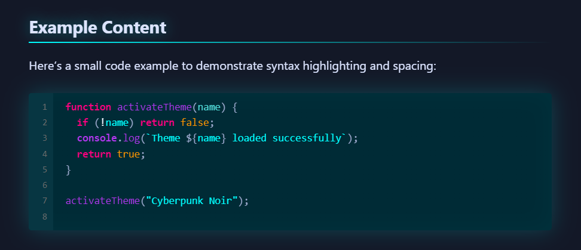
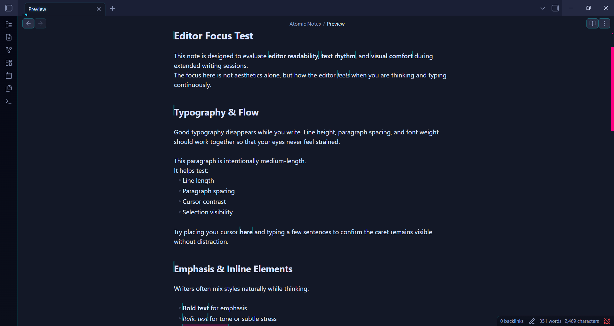

# Cyberpunk-Noir - Obsidian Theme

A dark, minimalist cyberpunk theme for Obsidian with enhanced code blocks, neon aesthetics, and CRT effects.


<div align="center">

### 📡 **Incoming Transmission** 📡
**Enjoying the neon vibes?**  
Inject a ⭐ **Star** into the mainframe to boost the signal!  
*It helps other Netrunners find this safehouse.*

</div>

## 🎨 Features

- **Dark Minimalist Design**: Deep blue/black backgrounds with high-contrast neon accents.
- **Neon Beam Cursor**: 3px wide glowing cursor that ensures you never lose your place.
- **Cyberpunk Code Blocks**:
    - CRT Scanline background texture.
    - Neon styling for scrollbars and copy buttons.
    - Glassmorphic look.
- **Visual Hierarchy**: Distinct colors for all heading levels (H1-H6).
- **Keyboard Styling**: Custom `<kbd>` styling for shortcuts.
- **Optimized Typography**: Variable font sizes for better readability.
- **Accessible**: Full support for `prefers-reduced-motion` to disable animations.
- **Hardware Efficient**: Optimized CSS that runs smoothly on most devices.

## 📸 Functionality Showcase

### Code Blocks & Scanlines
*Featuring neon scrollbars and scanline texture*


### Live Preview Editor
*Clean, borderless editing experience*


### Graph View
*Neon connected nodes*


### Reading Mode


## 🎯 Color Palette

- **Neon Pink**: `#ff0080` - Primary interaction color
- **Cyan**: `#00ffff` - Text accents and links
- **Neon Purple**: `#b537f2` - Secondary accents
- **Neon Green**: `#00ff41` - H4 sub-headings
- **Background**: `#050714` - Deep space blue-black

## 🚀 Installation

### From Obsidian (Recommended)

1. Open Obsidian Settings
2. Navigate to `Appearance` → `Themes`
3. Click `Manage`
4. Search for "Cyberpunk Noir"
5. Click `Install and use`

### Manual Installation

1. Download the latest release from [Releases](https://github.com/zoo-hair/obsidian-cyberpunk-theme/releases)
2. Extract the files
3. Copy `theme.css` and `manifest.json` to your vault's `.obsidian/themes/Cyberpunk-Noir/` folder
4. Open Obsidian Settings → Appearance → Themes
5. Select "Cyberpunk Noir" from the dropdown

## 🎨 Customization

The theme uses CSS variables that you can override with the **Style Settings** plugin (compatibility coming soon) or by adding a CSS snippet:

```css
body {
  --neon-pink: #ff0080;
  --neon-cyan: #00ffff;
  --font-text: 'your-font-here', sans-serif;
}
```

## 🔌 Plugin Compatibility

Tested and optimized for:
- **Dataview**
- **Calendar** (Custom neon styling included)
- **Kanban**
- **Tasks**
- **Excalidraw**

## 📝 Changelog

### v1.1.0 (Latest Update)
- **New Feature**: Neon Beam Cursor (3px width + glow).
- **New Feature**: CRT Scanlines for Code Blocks.
- **Improvement**: Fixed file explorer sliding animation bug.
- **Improvement**: Differentiated H4 color (Neon Green).
- **Style**: Added `<kbd>` key styling.
- **Fix**: Removed unwanted borders in Editing Mode.

## 🤝 Contributing

Contributions are welcome! Please feel free to submit a Pull Request.

1. Fork the repository
2. Create your feature branch (`git checkout -b feature/AmazingFeature`)
3. Commit your changes (`git commit -m 'Add some AmazingFeature'`)
4. Push to the branch (`git push origin feature/AmazingFeature`)
5. Open a Pull Request

## 📜 License

This theme is licensed under the MIT License - see the [LICENSE](LICENSE) file for details.

---

Made with 💜 by [Juhair Islam Sami](https://github.com/zoo-hair)
