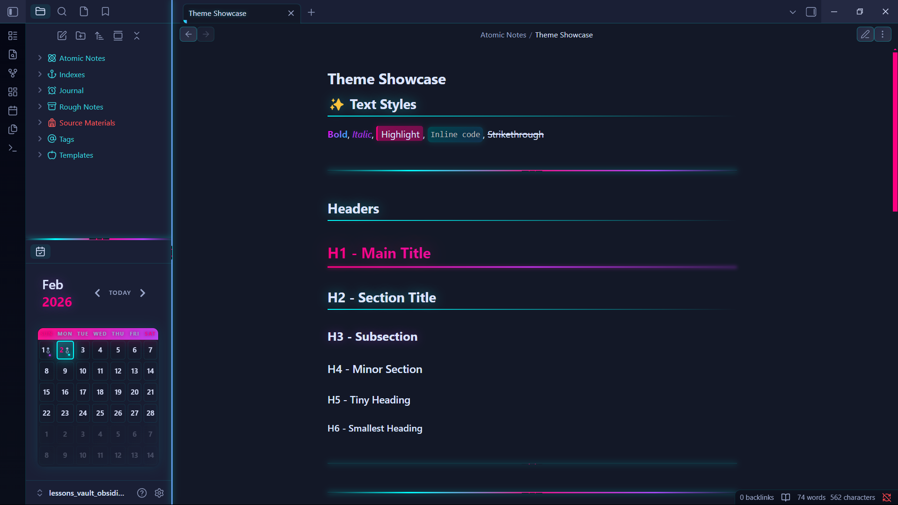

# Cyberpunk Noir - Obsidian Theme

A dark, minimalist cyberpunk theme for Obsidian with enhanced code blocks and neon aesthetics.



## 🎨 Features

- **Dark Minimalist Design**: Clean interface with a cyberpunk aesthetic
- **Enhanced Code Blocks**: Glowing borders, syntax highlighting, and neon accents
- **Cyberpunk Color Palette**: Pink, cyan, and purple neon colors
- **Optimized Typography**: Better readability with custom font support
- **Glowing Effects**: Subtle shadows and glows on interactive elements
- **Custom Scrollbars**: Styled with theme colors
- **Full Obsidian Support**: Styled for all major UI elements

## 🎯 Color Palette

- **Primary Pink**: `#ff006e` - Main accent color
- **Cyan**: `#00f5ff` - Links and highlights
- **Purple**: `#b537f2` - Secondary accent
- **Deep Blue**: `#3a0ca3` - Background accent
- **Orange**: `#ff9e00` - Numbers and booleans

## 📸 Screenshots

### Code Blocks


### Headers and Typography


### Full Interface


## 🚀 Installation

### From Obsidian (Recommended)

1. Open Obsidian Settings
2. Navigate to `Appearance` → `Themes`
3. Click `Manage`
4. Search for "Cyberpunk Noir"
5. Click `Install and use`

### Manual Installation

1. Download the latest release from [Releases](https://github.com/yourusername/obsidian-cyberpunk-theme/releases)
2. Extract the files
3. Copy `theme.css` and `manifest.json` to your vault's `.obsidian/themes/Cyberpunk-Noir/` folder
4. Open Obsidian Settings → Appearance → Themes
5. Select "Cyberpunk Noir" from the dropdown

### For Development

```bash
# Clone this repository
git clone https://github.com/yourusername/obsidian-cyberpunk-theme.git

# Navigate to your vault's themes folder
cd /path/to/your/vault/.obsidian/themes/

# Create symlink (or copy files)
ln -s /path/to/obsidian-cyberpunk-theme Cyberpunk-Noir
```

## 🎨 Customization

You can customize the theme by editing the CSS variables at the top of `theme.css`:

```css
.theme-dark {
  --cyber-pink: #ff006e;      /* Change primary accent */
  --cyber-cyan: #00f5ff;      /* Change link color */
  --cyber-purple: #b537f2;    /* Change secondary accent */
  --bg-primary: #0a0e27;      /* Change main background */
  /* ... and more */
}
```

## 💡 Recommended Plugins

This theme works great with:

- **Code Block Enhancer** - Additional code block features
- **Iconize** - Custom icons for folders and files
- **Style Settings** - Live theme customization (coming soon)

## 🔤 Recommended Fonts

For the best experience, install these fonts:

- **Fira Code** - For code blocks (supports ligatures)
- **JetBrains Mono** - Alternative monospace font
- **Inter** or **SF Pro** - For UI text

## 🐛 Known Issues

- Some community plugins may override theme styles
- Graph view colors may need adjustment for very large graphs

## ✨ Performance

This theme has been optimized for performance:
- Reduced glow effects for better FPS
- Efficient CSS selectors
- No heavy animations
- Mobile-friendly asset sizes

## 🔌 Plugin Compatibility

Tested and compatible with:
- Dataview
- Calendar
- Kanban
- Tasks
- Advanced Tables
- Excalidraw
- Templater
- Mind Map
- Outliner

## 📝 Changelog

### v1.0.0 (Initial Release)
- Dark minimalist cyberpunk design
- Enhanced code blocks with glowing borders
- Custom syntax highlighting
- Styled headers, links, lists, and tables
- Custom scrollbars
- Mobile optimization
- Plugin compatibility (Dataview, Calendar, Kanban, Tasks, etc.)
- Accessibility improvements (focus indicators, reduced motion support)
- Performance optimizations (reduced glow effects)
- WCAG AA contrast compliance

## 🤝 Contributing

Contributions are welcome! Please feel free to submit a Pull Request.

1. Fork the repository
2. Create your feature branch (`git checkout -b feature/AmazingFeature`)
3. Commit your changes (`git commit -m 'Add some AmazingFeature'`)
4. Push to the branch (`git push origin feature/AmazingFeature`)
5. Open a Pull Request

## 📜 License

This theme is licensed under the MIT License - see the [LICENSE](LICENSE) file for details.

## 🙏 Acknowledgments

- Inspired by cyberpunk aesthetics and neon noir themes
- Built for the amazing Obsidian community
- Thanks to all theme creators who shared their knowledge

## 💬 Support

If you enjoy this theme, consider:

- ⭐ Starring the repository
- 🐛 Reporting bugs via [Issues](https://github.com/yourusername/obsidian-cyberpunk-theme/issues)
- 💡 Suggesting features
- ☕ [Buying me a coffee](https://buymeacoffee.com/yourusername)

## 📧 Contact

- GitHub: [@zoo-hair](https://github.com/zoo-hair)


---

Made with 💜 for the Obsidian community